College Scorecard Data Analysis
================

##### *Olivia Roberts*

##### *Nate Wagner*

##### *October 24, 2019*

Introduction
------------

First calculated in the mid-90’s, graduation rate keeps record of full-time, first-time students who start college and graduate 4 years later. If graduation rates at an institution are low, it can be inferred that students do not get the academic support they need to succeed, they are disappointed by the faculty or staff, or that they find life at the school unaffordable. Due to the significant financial impact that secondary education has on the economy the government created a College Scorecard to provide reliable and unbiased information about college performance’ (1). It is pertinent for institutions to measure and improve their graduation rate as the number impacts the amount of performance based funding awarded to them by the government. In this analysis, we evaluate and assess the factors that most significantly influence an institution’s graduation rate for the years 2009- 2016 (2).

1.  <https://collegescorecard.ed.gov/assets/UsingFederalDataToMeasureAndImprovePerformance.pdf>
2.  <https://collegescorecard.ed.gov/data/>

Import Data
-----------

First step was to read the data into R by using sapply(), and passing in the files and the read\_csv function.

``` r
# files <- dir(path = "~/Documents/Data_munging_project/CollegeScorecard_Raw_Data")
# data <- sapply(files, read_csv, simplify=FALSE)
```

We then added a year column to each file.

``` r
# data$MERGED1996_97_PP.csv$YEAR <- 1996
# data$MERGED1997_98_PP.csv$YEAR <- 1997
# data$MERGED1998_99_PP.csv$YEAR <- 1998
# data$MERGED1999_00_PP.csv$YEAR <- 1999
# data$MERGED2000_01_PP.csv$YEAR <- 2000
# data$MERGED2001_02_PP.csv$YEAR <- 2001
# data$MERGED2002_03_PP.csv$YEAR <- 2002
# data$MERGED2003_04_PP.csv$YEAR <- 2003
# data$MERGED2004_05_PP.csv$YEAR <- 2004
# data$MERGED2005_06_PP.csv$YEAR <- 2005
# data$MERGED2006_07_PP.csv$YEAR <- 2006
# data$MERGED2007_08_PP.csv$YEAR <- 2007
# data$MERGED2008_09_PP.csv$YEAR <- 2008
# data$MERGED2009_10_PP.csv$YEAR <- 2009
# data$MERGED2010_11_PP.csv$YEAR <- 2010
# data$MERGED2011_12_PP.csv$YEAR <- 2011
# data$MERGED2012_13_PP.csv$YEAR <- 2012
# data$MERGED2013_14_PP.csv$YEAR <- 2013
# data$MERGED2014_15_PP.csv$YEAR <- 2014
# data$MERGED2015_16_PP.csv$YEAR <- 2015
# data$MERGED2016_17_PP.csv$YEAR <- 2016
# data$MERGED2017_18_PP.csv$YEAR <- 2017
```

Then we wrote each csv with the updated year column to files, where they were then merged in the command line.

``` r
# write_csv(data$MERGED1996_97_PP.csv, "college_scorecard1996.csv")
# write_csv(data$MERGED1997_98_PP.csv, "college_scorecard1997.csv")
# write_csv(data$MERGED1998_99_PP.csv, "college_scorecard1998.csv")
# write_csv(data$MERGED1999_00_PP.csv, "college_scorecard1999.csv")
# write_csv(data$MERGED2000_01_PP.csv, "college_scorecard2000.csv")
# write_csv(data$MERGED2001_02_PP.csv, "college_scorecard2001.csv")
# write_csv(data$MERGED2002_03_PP.csv, "college_scorecard2002.csv")
# write_csv(data$MERGED2003_04_PP.csv, "college_scorecard2003.csv")
# write_csv(data$MERGED2004_05_PP.csv, "college_scorecard2004.csv")
# write_csv(data$MERGED2005_06_PP.csv, "college_scorecard2005.csv")
# write_csv(data$MERGED2006_07_PP.csv, "college_scorecard2006.csv")
# write_csv(data$MERGED2007_08_PP.csv, "college_scorecard2007.csv")
# write_csv(data$MERGED2008_09_PP.csv, "college_scorecard2008.csv")
# write_csv(data$MERGED2009_10_PP.csv, "college_scorecard2009.csv")
# write_csv(data$MERGED2010_11_PP.csv, "college_scorecard2010.csv")
# write_csv(data$MERGED2011_12_PP.csv, "college_scorecard2011.csv")
# write_csv(data$MERGED2012_13_PP.csv, "college_scorecard2012.csv")
# write_csv(data$MERGED2013_14_PP.csv, "college_scorecard2013.csv")
# write_csv(data$MERGED2014_15_PP.csv, "college_scorecard2014.csv")
# write_csv(data$MERGED2015_16_PP.csv, "college_scorecard2015.csv")
# write_csv(data$MERGED2016_17_PP.csv, "college_scorecard2016.csv")
# write_csv(data$MERGED2017_18_PP.csv, "college_scorecard2017.csv")


# Command used to merge data:
#awk '(NR == 1) || (FNR > 1)' *.csv > CollegeData.csv
```

The file was read into R, and then used select() to subset only the columns of interest. We then wrote that to "merged.csv" so we don't have to load the entire dataset into R every time.

``` r
#collegeDataSubset <- read_csv("CollegeData.csv")

#collegeDataSubset <- select(CollegeData.csv, YEAR, C150_4, AVGFACSAL, COSTT4_A, COSTT4_P, TUITIONFEE_IN, TUITIONFEE_OUT, TUITIONFEE_PROG, TUITFTE, INEXPFTE, PCTPELL, PCTFLOAN, UG25ABV, UNITID, INSTNM, CITY, STABBR, ZIP, NUMBRANCH, HIGHDEG, CONTROL, LOCALE2, LATITUDE, LONGITUDE, ADM_RATE, ADM_RATE_ALL, SAT_AVG, ACTCMMID, UGDS, UG, UGDS_WHITE, UGDS_BLACK, UGDS_HISP, UGDS_ASIAN, NPT4_PUB, NPT4_PRIV, PAR_ED_PCT_1STGEN, PAR_ED_PCT_MS, PAR_ED_PCT_HS, PAR_ED_PCT_PS, DEP_INC_AVG, DEBT_MDN, GRAD_DEBT_MDN, WDRAW_DEBT_MDN, LO_INC_DEBT_MDN, MD_INC_DEBT_MDN, HI_INC_DEBT_MDN, FEMALE, FAMINC, MD_FAMINC, MN_EARN_WNE_P10, MD_EARN_WNE_P10)

#write_csv(collegeDataSubset, "merged.csv")
```

Data Validation
---------------

Read in new data as college\_scorecard and set the values "NULL" and "Privacy Suppressed" to NA. Also set all numeric variables to type "numeric".

``` r
# read in new data
college_scorecard <- read_csv("merged.csv")
#str(college_scorecard)


# set all NULL, PrivacySuppressed to NA
college_scorecard[college_scorecard == "NULL"] <- NA
college_scorecard[college_scorecard == "PrivacySuppressed"] <- NA

# change data types:
college_scorecard$YEAR <- as.numeric(college_scorecard$YEAR)
college_scorecard$C150_4 <- as.numeric(college_scorecard$C150_4)
college_scorecard$AVGFACSAL <- as.numeric(college_scorecard$AVGFACSAL)
college_scorecard$COSTT4_A <- as.numeric(college_scorecard$COSTT4_A)
college_scorecard$COSTT4_P <- as.numeric(college_scorecard$COSTT4_P)
college_scorecard$TUITIONFEE_IN <- as.numeric(college_scorecard$TUITIONFEE_IN)
college_scorecard$TUITIONFEE_OUT <- as.numeric(college_scorecard$TUITIONFEE_OUT)
college_scorecard$TUITIONFEE_PROG <- as.numeric(college_scorecard$TUITIONFEE_PROG)
college_scorecard$TUITFTE <- as.numeric(college_scorecard$TUITFTE)
college_scorecard$INEXPFTE <- as.numeric(college_scorecard$INEXPFTE)
college_scorecard$PCTPELL <- as.numeric(college_scorecard$PCTPELL)
college_scorecard$PCTFLOAN <- as.numeric(college_scorecard$PCTFLOAN)
college_scorecard$UG25ABV <- as.numeric(college_scorecard$UG25ABV)
college_scorecard$LATITUDE <- as.numeric(college_scorecard$LATITUDE)
college_scorecard$LONGITUDE <- as.numeric(college_scorecard$LONGITUDE)
college_scorecard$ADM_RATE <- as.numeric(college_scorecard$ADM_RATE)
college_scorecard$ADM_RATE_ALL <- as.numeric(college_scorecard$ADM_RATE_ALL)
college_scorecard$SAT_AVG <- as.numeric(college_scorecard$SAT_AVG)
college_scorecard$ACTCMMID <- as.numeric(college_scorecard$ACTCMMID)
college_scorecard$UG <- as.numeric(college_scorecard$UG)
college_scorecard$UGDS_WHITE <- as.numeric(college_scorecard$UGDS_WHITE)
college_scorecard$UGDS_BLACK <- as.numeric(college_scorecard$UGDS_BLACK)
college_scorecard$UGDS_HISP <- as.numeric(college_scorecard$UGDS_HISP)
college_scorecard$UGDS_ASIAN <- as.numeric(college_scorecard$UGDS_ASIAN)
college_scorecard$NPT4_PUB <- as.numeric(college_scorecard$NPT4_PUB)
college_scorecard$NPT4_PRIV <- as.numeric(college_scorecard$NPT4_PRIV)
college_scorecard$PAR_ED_PCT_1STGEN <- as.numeric(college_scorecard$PAR_ED_PCT_1STGEN)
college_scorecard$PAR_ED_PCT_MS <- as.numeric(college_scorecard$PAR_ED_PCT_MS)
college_scorecard$PAR_ED_PCT_HS <- as.numeric(college_scorecard$PAR_ED_PCT_HS)
college_scorecard$PAR_ED_PCT_PS <- as.numeric(college_scorecard$PAR_ED_PCT_PS)
college_scorecard$DEP_INC_AVG <- as.numeric(college_scorecard$DEP_INC_AVG)
college_scorecard$DEBT_MDN <- as.numeric(college_scorecard$DEBT_MDN)
college_scorecard$GRAD_DEBT_MDN <- as.numeric(college_scorecard$GRAD_DEBT_MDN)
college_scorecard$WDRAW_DEBT_MDN <- as.numeric(college_scorecard$WDRAW_DEBT_MDN)
college_scorecard$LO_INC_DEBT_MDN <- as.numeric(college_scorecard$LO_INC_DEBT_MDN)
college_scorecard$MD_INC_DEBT_MDN <- as.numeric(college_scorecard$MD_INC_DEBT_MDN)
college_scorecard$HI_INC_DEBT_MDN <- as.numeric(college_scorecard$HI_INC_DEBT_MDN)
college_scorecard$FEMALE <- as.numeric(college_scorecard$FEMALE)
college_scorecard$FAMINC <- as.numeric(college_scorecard$FAMINC)
college_scorecard$MD_FAMINC <- as.numeric(college_scorecard$MD_FAMINC)
college_scorecard$MN_EARN_WNE_P10 <- as.numeric(college_scorecard$MN_EARN_WNE_P10)
college_scorecard$MD_EARN_WNE_P10 <- as.numeric(college_scorecard$MD_EARN_WNE_P10)
```

Missing Values
--------------

There is definitely significant missing data, with roughly 71% of graduation rate missing of roughly 154,000 rows.

Here is total missing data for variables with above average missing data.

``` r
sum.NA.total <- college_scorecard %>%
  select(everything()) %>%
  summarise_all(funs(sum(is.na(.))))
SumNA <- sum.NA.total %>% map_dbl(sum)
test <- SumNA[SumNA > rowMeans(sum.NA.total)] 
kable(test, format = "markdown")
```

|                    |       x|
|:-------------------|-------:|
| C150\_4            |  109662|
| COSTT4\_A          |  118589|
| COSTT4\_P          |  132332|
| TUITIONFEE\_IN     |   79394|
| TUITIONFEE\_OUT    |   81437|
| TUITIONFEE\_PROG   |  112990|
| PCTPELL            |   86847|
| PCTFLOAN           |   93269|
| UG25ABV            |   88503|
| LOCALE2            |  154282|
| LATITUDE           |  147614|
| LONGITUDE          |  147614|
| ADM\_RATE          |  111699|
| ADM\_RATE\_ALL     |  107644|
| SAT\_AVG           |  130475|
| ACTCMMID           |  133351|
| UG                 |  148139|
| UGDS\_WHITE        |   86458|
| UGDS\_BLACK        |   86458|
| UGDS\_HISP         |   86458|
| UGDS\_ASIAN        |   86458|
| NPT4\_PUB          |  137528|
| NPT4\_PRIV         |  118532|
| MD\_INC\_DEBT\_MDN |   74465|
| HI\_INC\_DEBT\_MDN |   75010|
| MN\_EARN\_WNE\_P10 |  119439|
| MD\_EARN\_WNE\_P10 |  119439|

Here is the % of missing data for the column and only variables with above average missing data.

``` r
PropOfNA.total <- (sum.NA.total/nrow(college_scorecard))*100
SumNA.prop <- PropOfNA.total %>% map_dbl(sum)
prop <- SumNA.prop[SumNA.prop > rowMeans(PropOfNA.total)]
kable(prop, format = "markdown")
```

|                    |          x|
|:-------------------|----------:|
| C150\_4            |   71.07893|
| COSTT4\_A          |   76.86509|
| COSTT4\_P          |   85.77281|
| TUITIONFEE\_IN     |   51.46031|
| TUITIONFEE\_OUT    |   52.78451|
| TUITIONFEE\_PROG   |   73.23602|
| PCTPELL            |   56.29108|
| PCTFLOAN           |   60.45358|
| UG25ABV            |   57.36444|
| LOCALE2            |  100.00000|
| LATITUDE           |   95.67804|
| LONGITUDE          |   95.67804|
| ADM\_RATE          |   72.39924|
| ADM\_RATE\_ALL     |   69.77094|
| SAT\_AVG           |   84.56917|
| ACTCMMID           |   86.43328|
| UG                 |   96.01833|
| UGDS\_WHITE        |   56.03894|
| UGDS\_BLACK        |   56.03894|
| UGDS\_HISP         |   56.03894|
| UGDS\_ASIAN        |   56.03894|
| NPT4\_PUB          |   89.14066|
| NPT4\_PRIV         |   76.82815|
| MD\_INC\_DEBT\_MDN |   48.26551|
| HI\_INC\_DEBT\_MDN |   48.61876|
| MN\_EARN\_WNE\_P10 |   77.41603|
| MD\_EARN\_WNE\_P10 |   77.41603|

Exploratory Data Analysis
-------------------------

We found that graduation rate ranges from 0.00% to 100%. Also the mean is equal to the median, indicating that there is not significant skew in the data.

``` r
summary(college_scorecard$C150_4)
```

    ##    Min. 1st Qu.  Median    Mean 3rd Qu.    Max.    NA's 
    ##    0.00    0.34    0.48    0.48    0.63    1.00  109662

Number of observations with graduation rate equal to zero:

``` r
zero <- select(college_scorecard, C150_4, YEAR, INSTNM) %>% dplyr::filter(C150_4 == 0) %>% count()
kable(zero)
```

<table>
<thead>
<tr>
<th style="text-align:right;">
n
</th>
</tr>
</thead>
<tbody>
<tr>
<td style="text-align:right;">
651
</td>
</tr>
</tbody>
</table>
Number of observations with graduation rate equal to one:

``` r
one <- select(college_scorecard, C150_4, YEAR, INSTNM) %>% dplyr::filter(C150_4 == 1) %>% count()
kable(one)
```

<table>
<thead>
<tr>
<th style="text-align:right;">
n
</th>
</tr>
</thead>
<tbody>
<tr>
<td style="text-align:right;">
475
</td>
</tr>
</tbody>
</table>
Here we have schools with graduation rate equal to zero, ordered by number of undergrads

``` r
query <- select(college_scorecard, INSTNM, YEAR, C150_4, UG) %>% dplyr::filter(C150_4 == 0) %>% arrange(UG)
top10.query <- head(query, 10)
kable(top10.query, format = 'markdown')
```

| INSTNM                                                        |  YEAR|  C150\_4|   UG|
|:--------------------------------------------------------------|-----:|--------:|----:|
| Mesivtha Tifereth Jerusalem of America                        |  2000|        0|   35|
| Magnolia Bible College                                        |  2000|        0|   37|
| Hellenic College-Holy Cross Greek Orthodox School of Theology |  2000|        0|   47|
| LIU Brentwood                                                 |  2000|        0|   94|
| Midwestern Baptist Theological Seminary                       |  2000|        0|  110|
| Trinity College of Florida                                    |  2000|        0|  147|
| Burlington College                                            |  2000|        0|  206|
| Notre Dame College                                            |  2000|        0|  215|
| National American University-Roseville                        |  2000|        0|  586|
| STRAYER UNIVERSITY-LOUDOUN CAMPUS                             |  2000|        0|  861|

Here we have schools with graduation rate equal to one, ordered by number of undergrads

``` r
#schools with grad rate == 1, ordered by # undergrads
query2 <- select(college_scorecard, INSTNM, YEAR, C150_4, UG) %>% dplyr::filter(C150_4 == 1) %>% arrange(UG)
top10.query2 <- head(query2, 10)
kable(top10.query2, format = 'markdown')
```

| INSTNM                                             |  YEAR|  C150\_4|   UG|
|:---------------------------------------------------|-----:|--------:|----:|
| BANGOR THEOLOGICAL SEMINARY                        |  2000|        1|    0|
| Saint Lukes Hospital Medical Technology Program    |  2000|        1|    6|
| Mid-America College of Funeral Service             |  2000|        1|   36|
| Longy School of Music of Bard College              |  2000|        1|   37|
| Winebrenner Theological Seminary                   |  2000|        1|   54|
| Holy Apostles College and Seminary                 |  2000|        1|   68|
| Heritage Christian University                      |  2000|        1|   95|
| MASSACHUSETTS COLLEGE OF PHARMACY AND HEALTH SCIEN |  2000|        1|  102|
| John Wesley University                             |  2000|        1|  154|
| Jewish Theological Seminary of America             |  2000|        1|  180|

We decided to look up some of these schools with graduation rates equal to zero. Some of the schools were new, some are just very small, and some we could find no information on. We decided to leave out rows where the graduation rate was equal to zero. It doesn't make much sense for a school with 861 undergrades to have a graduation rate of zero for a particular year.

We removed rows with graduation rate equal to zero and rows with NA graduation rate:

``` r
# To leave out rows with grad rate == 0 or NA
college1 <- college_scorecard %>% dplyr::filter(college_scorecard$C150_4 != 0)
college <- college1 %>% filter(!is.na(college1$C150_4))
```

Analyze Response
----------------

Over time we can see there has been more data collected / school participation.

``` r
query3 <- select(college, C150_4, YEAR) %>% group_by(YEAR) %>% count()
grad.rate.bar <- ggplot(query3, aes(YEAR, n)) + geom_bar(stat="identity", width = 0.5, fill="tomato2") + labs(title = "Number of Observations by Year", y = "Count", x = "Year") + theme_classic()
grad.rate.bar
```

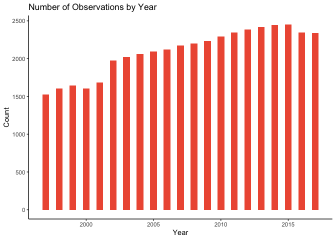

There has been a steady graduation rate over time.

``` r
query3.1 <- select(college, C150_4, YEAR) %>% group_by(YEAR) %>% summarise(average = mean(C150_4))
grad.rate.by.year <- ggplot(query3.1, aes(YEAR, average)) + geom_bar(stat="identity", width = 0.5, fill="tomato2") + labs(title = "Average Graduation Rate by Year", y = "Average Graduation Rate", x = "Year") + theme_classic()
grad.rate.by.year
```

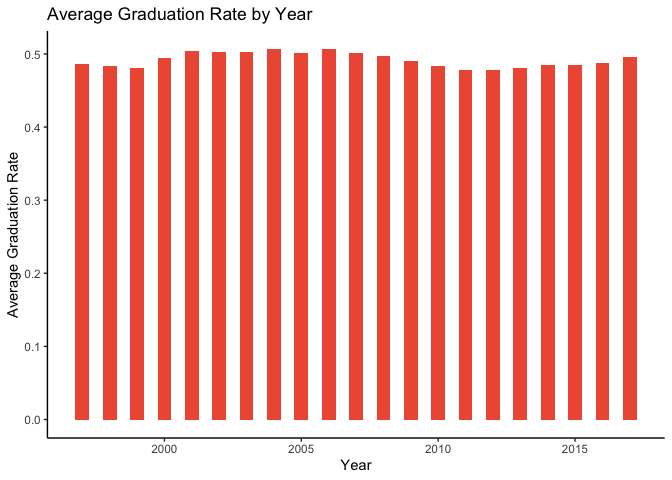

The distribution of graduation rate is approximately normal with a mean of 0.49 and standard deviation of 0.21.

``` r
grad.rate.hist <- ggplot(college, aes(x = C150_4)) + geom_histogram(color="darkblue", fill="lightblue") + labs(title = "Histogram of Graduation Rate",x = "Graduation Rate") + theme_classic()
grad.rate.hist
```

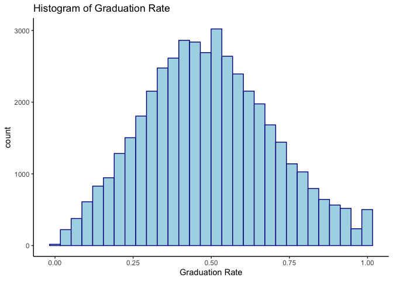

Here is a map of average graduation rate by state, with darker green colors indicating a higher average graduation rate.

<p class="caption">
A caption
</p>

An interactive map: <http://127.0.0.1:12642/custom/googleVis/GeoChartID99057bbae7ce.html>

Here we have the bottom ten lowest average graduation rate of our sample.

``` r
bottom10 <- df %>% arrange(data.Average)
colnames(bottom10)[colnames(bottom10) == "data.State"] <- "State"
colnames(bottom10)[colnames(bottom10) == "data.Average"] <- "Average Graduation Rate"
kable(bottom10[1:10,], format = "markdown")
```

| State          |  Average Graduation Rate|
|:---------------|------------------------:|
| American Samoa |                     0.27|
| Nevada         |                     0.27|
| Virgin Islands |                     0.28|
| Alaska         |                     0.31|
| Oklahoma       |                     0.35|
| Georgia        |                     0.36|
| Hawaii         |                     0.36|
| Puerto Rico    |                     0.36|
| North Dakota   |                     0.37|
| New Mexico     |                     0.37|

Here we have the top ten highest average graduation rate of our sample.

``` r
top10 <- df %>% arrange(desc(data.Average))
colnames(top10)[colnames(top10) == "data.State"] <- "State"
colnames(top10)[colnames(top10) == "data.Average"] <- "Average Graduation Rate"
kable(top10[1:10,], format = "markdown")
```

| State         |  Average Graduation Rate|
|:--------------|------------------------:|
| Rhode Island  |                     0.67|
| Massachusetts |                     0.61|
| Iowa          |                     0.58|
| Pennsylvania  |                     0.58|
| Connecticut   |                     0.57|
| Illinois      |                     0.54|
| New Hampshire |                     0.54|
| Wyoming       |                     0.54|
| California    |                     0.53|
| Maryland      |                     0.53|

Split Data Into Test and Train
------------------------------

``` r
# set seed:
set.seed(1234)

# create an ID for each row:
college <- college %>% mutate(id = row_number())

#Create training set
college.train <- college %>% sample_frac(.70)

#Create test set
college.test  <- anti_join(college, college.train, by = 'id')

# took numeric columns and exported to CSV for python file
numeric.columns <- dplyr::select_if(college.train, is.numeric)
#write_csv(numeric.columns, "numeric.columns.csv")
```

Correlation Matrix
------------------

``` r
# compute cor from all numeric columns:
cor.matrix <- round(cor(numeric.columns, use = "pairwise"), 2)

# melt the cor matrix:
cor.matrix.melt <- melt(cor.matrix)
```

``` r
# plot cor matrix
ggplot(data = cor.matrix.melt, aes(x=X1, y=X2, fill=value)) + 
  geom_tile() + theme(axis.text.x = element_text(angle=65, vjust=0.6))
```

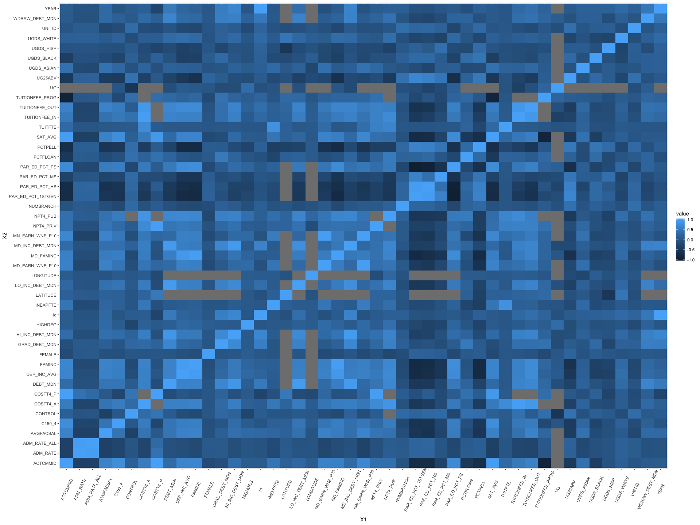

All variables with absolute value of correlation greater than 0.50:

``` r
# get corr of grad rate vs everything else:
grad.rate.r <- data.frame(cor.matrix[2,])
colnames(grad.rate.r)[colnames(grad.rate.r) == "cor.matrix.2..."] <- "Correlation"

# subset data to return all varaibles with cor > 0.50:
grad.rate.r.sub <- subset(grad.rate.r, abs(Correlation) > 0.50)
kable(grad.rate.r.sub, format = 'markdown')
```

|                      |  Correlation|
|:---------------------|------------:|
| C150\_4              |         1.00|
| COSTT4\_A            |         0.54|
| TUITIONFEE\_OUT      |         0.55|
| SAT\_AVG             |         0.78|
| ACTCMMID             |         0.77|
| NPT4\_PUB            |         0.54|
| PAR\_ED\_PCT\_1STGEN |        -0.58|
| PAR\_ED\_PCT\_HS     |        -0.56|
| PAR\_ED\_PCT\_PS     |         0.58|
| DEP\_INC\_AVG        |         0.57|
| FAMINC               |         0.59|
| MD\_FAMINC           |         0.57|

Now we took a subset of the data with only those variables above.

``` r
# subset data to return all columns with cor < 0.50
college.train.highR <- select(college.train, C150_4, COSTT4_A, TUITIONFEE_OUT, SAT_AVG, NPT4_PUB, PAR_ED_PCT_1STGEN, PAR_ED_PCT_HS, PAR_ED_PCT_PS, DEP_INC_AVG, FAMINC)
```

Looped through to compute scatter plots vs graduation rate.

``` r
# function to plot all variables of interest vs graduation rate:
plotScatFunc <- function(x, na.rm = TRUE, ...) {
  nm <- names(x)
  for (i in seq_along(nm)) {
print(ggplot(x, aes_string(x = nm[i], y= nm[1])) + geom_point(alpha = 0.3, fill = "blue") + 
  geom_smooth(method = "lm")) + theme_classic()

  }
}

plotScatFunc(college.train.highR)
```

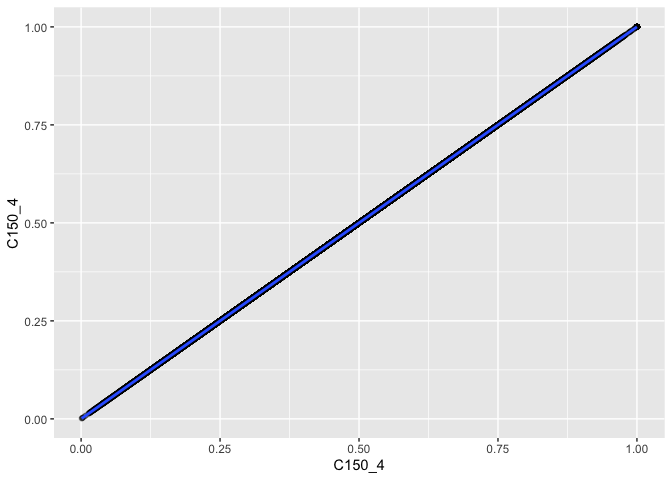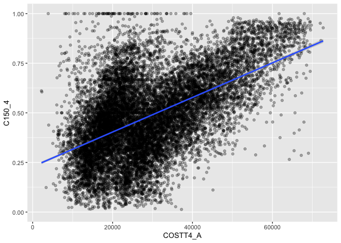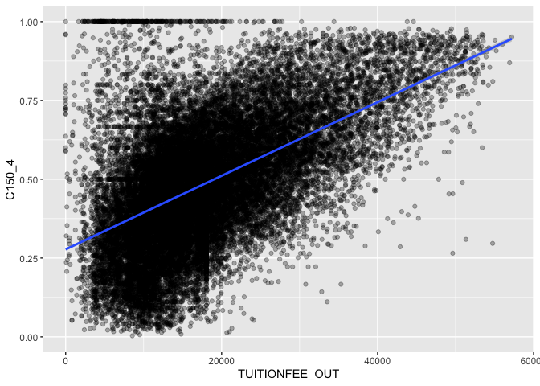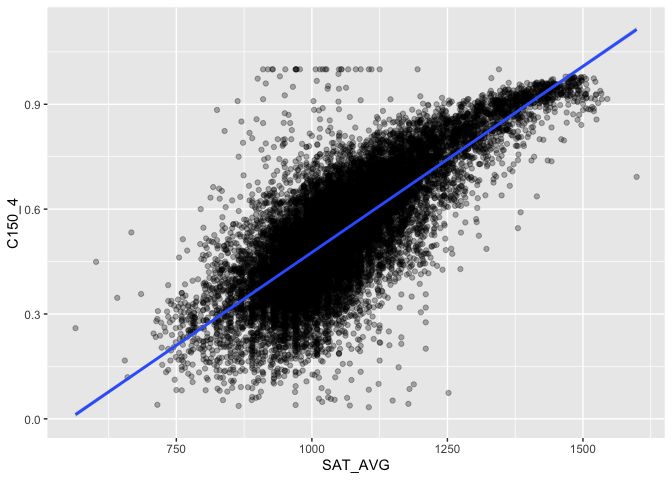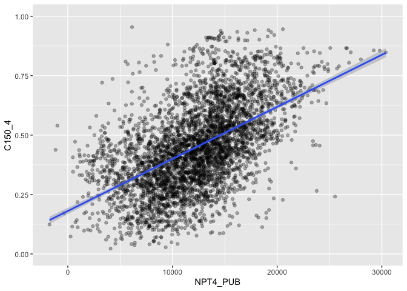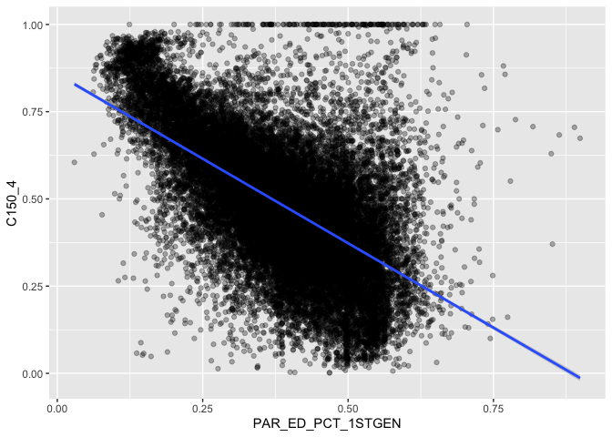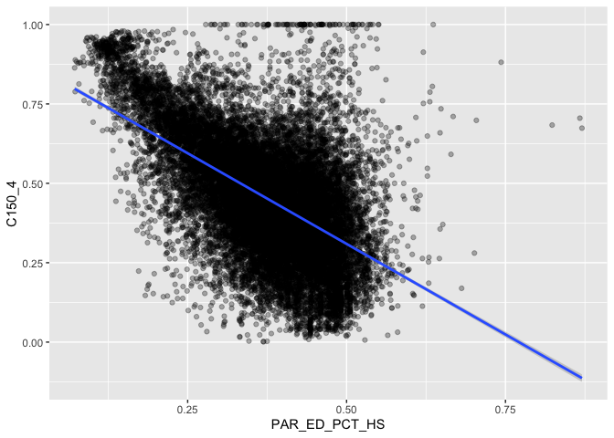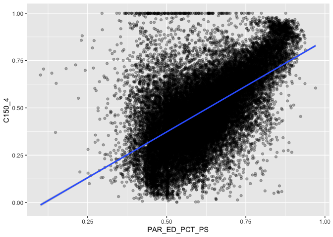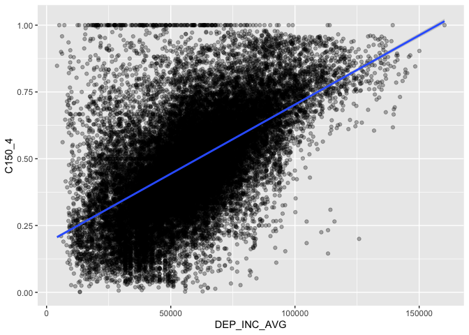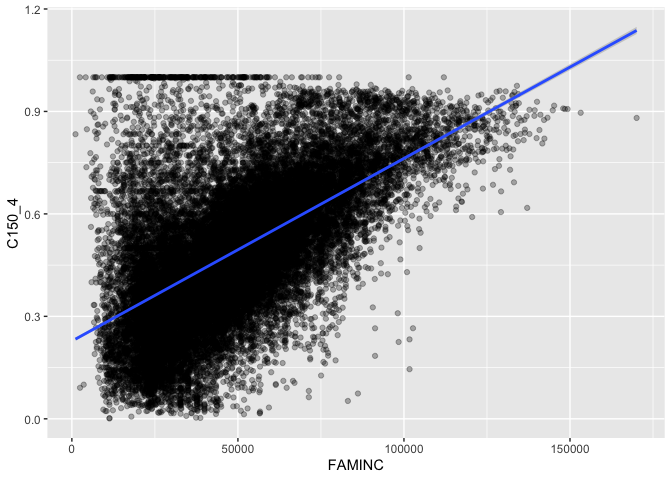

Predict Graduation Rate With Linear Regression:
-----------------------------------------------

We started by grabbing only complete cases:

``` r
# test:
college.test.highR <- select(college.test, C150_4, COSTT4_A, TUITIONFEE_OUT, SAT_AVG, NPT4_PUB, PAR_ED_PCT_1STGEN, PAR_ED_PCT_HS, PAR_ED_PCT_PS, DEP_INC_AVG, FAMINC)
college.test.highR.com <- college.test.highR %>% filter(complete.cases(.))

# train:
college.train.highR.com <- college.train.highR %>% filter(complete.cases(.))
```

Now to confirm train data with complete cases is consistent with the data:

``` r
# GGPLOT hist of grad rate for train data
grad.rate.train.hist <- ggplot(college.train.highR.com, aes(x = C150_4)) + geom_histogram(color="darkblue", fill="lightblue") + labs(title = "Train Data",x = "Graduation Rate") + theme_classic()


college.train.highR.year <- select(college.train, YEAR, C150_4, COSTT4_A, TUITIONFEE_OUT, SAT_AVG, NPT4_PUB, PAR_ED_PCT_1STGEN, PAR_ED_PCT_HS, PAR_ED_PCT_PS, DEP_INC_AVG, FAMINC)
college.train.highR.year.com <- college.train.highR.year %>% filter(complete.cases(.))

# GGPLOT bar of grad rate by year train data
query5 <- select(college.train.highR.year.com, C150_4, YEAR) %>% group_by(YEAR) %>% count()


grad.rate.train.bar <- ggplot(query5, aes(YEAR, n)) + geom_bar(stat="identity", width = 0.5, fill="tomato2") + 
labs(title = "Train Data", y = "Count", x = "Year") + theme_classic()
```

The distribution of graduation rate is still approximately normal with mean 0.49.

``` r
grid.arrange(grad.rate.hist, grad.rate.train.hist, ncol=2)
```

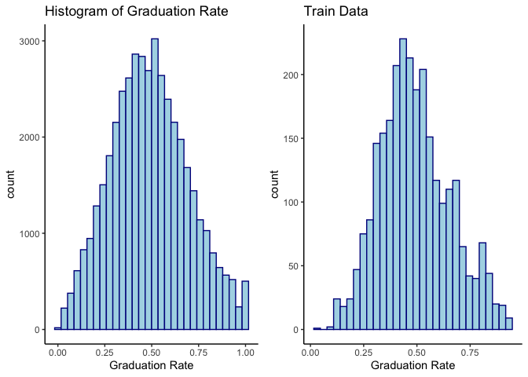

However, we now only have years in the range 2009 to 2016. But this should be fine because graduation rate has stayed consistent over time.

``` r
summary(college.train.highR.year.com$YEAR)
```

    ##    Min. 1st Qu.  Median    Mean 3rd Qu.    Max. 
    ##    2009    2011    2013    2013    2014    2016

``` r
grid.arrange(grad.rate.bar, grad.rate.train.bar, ncol=2)
```

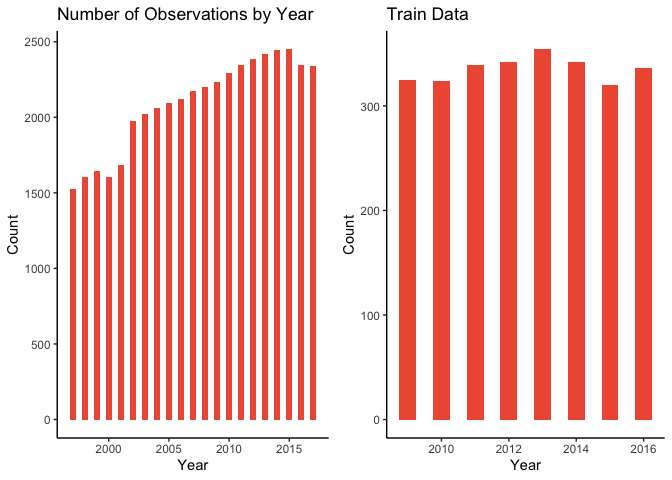

We now have 2682 observations for the train data and 1165 observations for the test data.

``` r
# check # of complete cases:
sum(complete.cases(college.train.highR))
```

    ## [1] 2682

``` r
sum(complete.cases(college.test.highR.com))
```

    ## [1] 1165

Our first regression uses all the explanatory variables.

<table style="width:100%;">
<colgroup>
<col width="22%" />
<col width="77%" />
</colgroup>
<thead>
<tr class="header">
<th align="left">variables</th>
<th align="left">variable_desc</th>
</tr>
</thead>
<tbody>
<tr class="odd">
<td align="left">COSTT4_A</td>
<td align="left">Average cost of attendance</td>
</tr>
<tr class="even">
<td align="left">SAT_AVG</td>
<td align="left">Average SAT score</td>
</tr>
<tr class="odd">
<td align="left">TUITIONFEE_OUT</td>
<td align="left">Out-of-state tuition and fees</td>
</tr>
<tr class="even">
<td align="left">NPT4_PUB</td>
<td align="left">Average net price for Title IV institutions</td>
</tr>
<tr class="odd">
<td align="left">PAR_ED_PCT_1STGEN</td>
<td align="left">% first-generation students</td>
</tr>
<tr class="even">
<td align="left">PAR_ED_PCT_HS</td>
<td align="left">% of students whose parents' highest educ is high school</td>
</tr>
<tr class="odd">
<td align="left">PAR_ED_PCT_PS</td>
<td align="left">% of students whose parents' highest educ level - post secondary</td>
</tr>
<tr class="even">
<td align="left">FAMINC</td>
<td align="left">Average family income in real 2015 dollars</td>
</tr>
</tbody>
</table>

``` r
# Model 1
fit1 <- lm(C150_4 ~ COSTT4_A +  + SAT_AVG + TUITIONFEE_OUT + NPT4_PUB + PAR_ED_PCT_1STGEN + PAR_ED_PCT_HS + PAR_ED_PCT_PS + FAMINC, data = college.train.highR.com)
summary(fit1)
```

    ## 
    ## Call:
    ## lm(formula = C150_4 ~ COSTT4_A + +SAT_AVG + TUITIONFEE_OUT + 
    ##     NPT4_PUB + PAR_ED_PCT_1STGEN + PAR_ED_PCT_HS + PAR_ED_PCT_PS + 
    ##     FAMINC, data = college.train.highR.com)
    ## 
    ## Residuals:
    ##      Min       1Q   Median       3Q      Max 
    ## -0.29502 -0.05157  0.00418  0.05681  0.41721 
    ## 
    ## Coefficients: (1 not defined because of singularities)
    ##                     Estimate Std. Error t value Pr(>|t|)    
    ## (Intercept)       -4.813e-01  2.985e-02 -16.124  < 2e-16 ***
    ## COSTT4_A           9.988e-06  9.503e-07  10.510  < 2e-16 ***
    ## SAT_AVG            6.845e-04  2.080e-05  32.900  < 2e-16 ***
    ## TUITIONFEE_OUT     5.411e-07  4.206e-07   1.287 0.198326    
    ## NPT4_PUB          -3.553e-06  9.253e-07  -3.840 0.000126 ***
    ## PAR_ED_PCT_1STGEN  8.284e-01  8.087e-02  10.243  < 2e-16 ***
    ## PAR_ED_PCT_HS     -1.099e+00  9.384e-02 -11.708  < 2e-16 ***
    ## PAR_ED_PCT_PS             NA         NA      NA       NA    
    ## FAMINC             2.985e-06  1.601e-07  18.646  < 2e-16 ***
    ## ---
    ## Signif. codes:  0 '***' 0.001 '**' 0.01 '*' 0.05 '.' 0.1 ' ' 1
    ## 
    ## Residual standard error: 0.0803 on 2674 degrees of freedom
    ## Multiple R-squared:  0.7636, Adjusted R-squared:  0.7629 
    ## F-statistic:  1234 on 7 and 2674 DF,  p-value: < 2.2e-16

We found that all variables were significant except for TUITIONFEE\_OUT and PAR\_ED\_PCT\_PS. We also have a strong R^2 of 0.76.

We ran the regression again but without TUITIONFEE\_OUT and PAR\_ED\_PCT\_PS.

``` r
# Model 2
fit2 <- lm(C150_4 ~ COSTT4_A +  + SAT_AVG + TUITIONFEE_OUT + PAR_ED_PCT_1STGEN + PAR_ED_PCT_HS + FAMINC, data = college.train.highR.com)
summary(fit2)
```

    ## 
    ## Call:
    ## lm(formula = C150_4 ~ COSTT4_A + +SAT_AVG + TUITIONFEE_OUT + 
    ##     PAR_ED_PCT_1STGEN + PAR_ED_PCT_HS + FAMINC, data = college.train.highR.com)
    ## 
    ## Residuals:
    ##      Min       1Q   Median       3Q      Max 
    ## -0.27848 -0.05125  0.00422  0.05692  0.42342 
    ## 
    ## Coefficients:
    ##                     Estimate Std. Error t value Pr(>|t|)    
    ## (Intercept)       -4.773e-01  2.991e-02 -15.959  < 2e-16 ***
    ## COSTT4_A           7.032e-06  5.585e-07  12.590  < 2e-16 ***
    ## SAT_AVG            6.949e-04  2.068e-05  33.609  < 2e-16 ***
    ## TUITIONFEE_OUT     1.135e-06  3.921e-07   2.895  0.00382 ** 
    ## PAR_ED_PCT_1STGEN  9.380e-01  7.586e-02  12.365  < 2e-16 ***
    ## PAR_ED_PCT_HS     -1.221e+00  8.849e-02 -13.799  < 2e-16 ***
    ## FAMINC             2.739e-06  1.471e-07  18.624  < 2e-16 ***
    ## ---
    ## Signif. codes:  0 '***' 0.001 '**' 0.01 '*' 0.05 '.' 0.1 ' ' 1
    ## 
    ## Residual standard error: 0.08051 on 2675 degrees of freedom
    ## Multiple R-squared:  0.7623, Adjusted R-squared:  0.7617 
    ## F-statistic:  1429 on 6 and 2675 DF,  p-value: < 2.2e-16

This time all explanatory variables are significant and our R^2 remained strong at 0.76.

To confirm normality of the residuals:

``` r
# check normality of residuals
plot(fit2$residuals, ylab = "residuals")
```

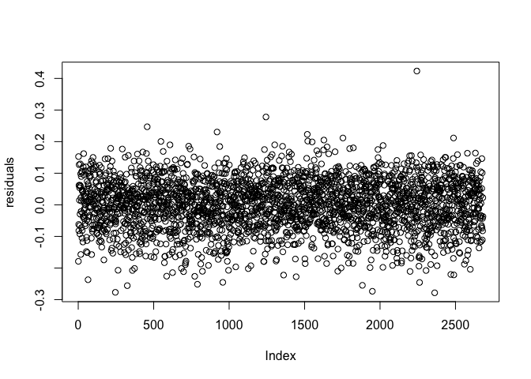

``` r
hist(fit2$residuals, main = "Histogram of Residuals", xlab = "Residuals")
```

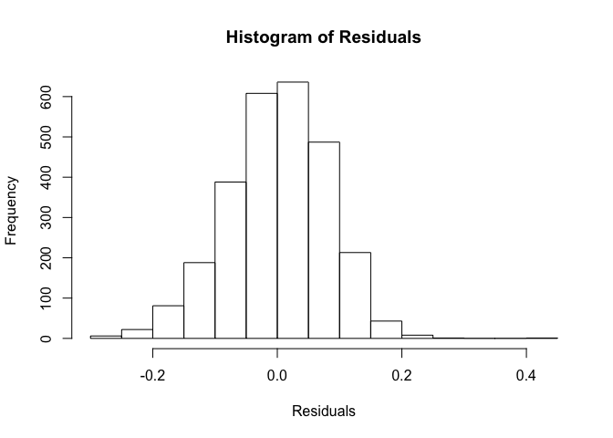

``` r
qqnorm(fit2$residuals)
```

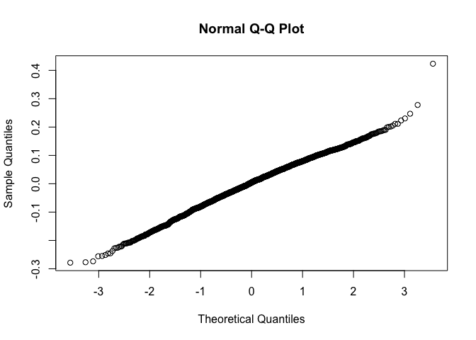

Now to predict graduation rate using our model. The resulting RMSE was 0.08.

``` r
# predict grad rate with test data:
predictions <- fit2 %>% predict(college.test.highR.com)

# compute R2, RMSE, and MAE from 2 models:
results <- data.frame(R2 = R2(predictions, college.test.highR.com$C150_4),
           RMSE = RMSE(predictions, college.test.highR.com$C150_4),
           MAE = MAE(predictions, college.test.highR.com$C150_4))
kable(results, format = "markdown")
```

|         R2|       RMSE|        MAE|
|----------:|----------:|----------:|
|  0.7542626|  0.0809669|  0.0638532|

``` r
# plot of grad rate vs predicted grad rate:
plot(college.test.highR.com$C150_4, predictions, xlim=c(0.2,1), ylim=c(0.2,1), main = "Plot of Predicted Grad Rates vs Actual", xlab=("Graduation Rate"), ylab=("Predicted Graduation Rate"))
abline(coef=c(0,1), col = "red")
```

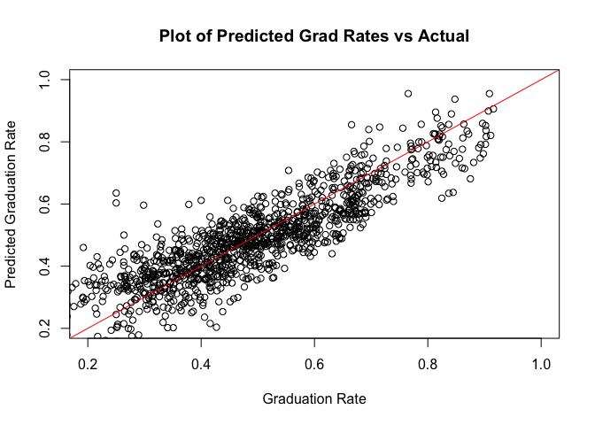

Conclusion
----------

It can be concluded that factors including average cost of attendance, tuition and fees for out of state students, an institution’s percentage of first generation students, an institution’s percentage of students who’s parents highest education is high school, and average family income are statistically significant in relation to graduation rates. The regression assumption of independence and normal distribution of the error term was confirmed in the residual plots as well as normality of the response variable graduation rate in the histogram. Additionally, the relatively small RMSE (0.07 &lt; 0.5) resulting from the cross validation method suggests that the model will be respectively accurate in practice for predicting graduation rates utilizing the reported explanatory variables. It is notable to state that there is a lack of data on students who do not receive Title IV aid that may result in somewhat biased estimates of collective student outcomes at institutions with low proportions of Title IV aided students as well as the observations regressed on only span from 2009-2016. However, relative to other publicly available data sources that have their own limitations, the data is still likely to be a significant improvement in providing insight for conditions shaping the graduation rates at various institutions.
